# Customer Lifetime Value with Long-Term Optimization

**A production-grade decision intelligence system: from raw retail transactions to budget-constrained, fully explainable retention targeting with quantified ROI**


**Author:** Ramesh Shrestha &nbsp;|&nbsp; [LinkedIn](https://www.linkedin.com/in/rameshsta/)

---

## Documentation Quick Reference

| Document | Description |
|---|---|
| [Model Card](docs/model_card.md) | Algorithm selection, SHAP results, calibration, monitoring thresholds |
| [Business Problem](docs/business_problem.md) | Problem framing, stakeholder context, success metrics |
| [Architecture Overview](docs/architecture_overview.md) | System design, data flow, module responsibilities |
| [Feature Engineering](docs/feature_engineering.md) | Feature design, leakage prevention, cutoff-safe computation |
| [Evaluation Strategy](docs/evaluation_strategy.md) | Holdout methodology, metric rationale, bootstrap CI design |
| [Mathematical Intuition](docs/Mathintuition_datascienceframing.md) | BG/NBD + Gamma-Gamma derivations, churn label design |
| [Business Impact & ROI](docs/business_impact_and_roi.md) | Full ROI narrative, segment strategy, decision framework |
| [Modeling Assumptions](docs/modeling_assumptions.md) | Assumptions, risks, sensitivity bounds |
| [Deployment Plan](docs/deployment_plan.md) | Production readiness, monitoring plan, retraining triggers |
| [Data Quality Rules](docs/data_quality_rules.md) | 7-rule cleaning specification, edge case handling |

---

## The Business Problem

In retail and e-commerce, every customer team faces the same constraint: **limited retention budget, unlimited customers to target.**

Without a rigorous system, teams default to three failing strategies:

| Strategy | What goes wrong |
|---|---|
| **Blanket campaigns** | Same message, same offer to all customers — no differentiation, wasted spend |
| **Heuristic targeting** | "Target our biggest spenders" — ignores churn risk; spends budget on customers who would have stayed |
| **Static RFM buckets** | Segment labels without economic value attached — no way to prioritise within segments |

**The result:** Budget is spent on the wrong customers, retention ROI is unmeasured, and the business loses high-value customers it could have saved.

### What this data reveals

This system was built on the **UCI Online Retail II dataset** — 1M+ real transactions from a UK-based online retailer (2009–2011). Three facts from this data define the problem:

> **1. Revenue is dangerously concentrated.**
> Top 10% of customers generate **62% of total revenue**. Gini coefficient = **0.726** — near wealth-inequality levels.

> **2. High-value customers churn at an alarming rate.**
> The "At Risk" segment — customers who were previously frequent buyers — has **64% churn probability** and represents **£1.25M of threatened revenue** (10% of total).

> **3. Churn prediction alone is not enough.**
> Predicting who might churn does not tell you who to *spend* your budget on. That requires combining churn probability, expected future value, and cost — simultaneously, under a constraint.

---

## The Solution

This project builds an **11-step, config-driven decision intelligence pipeline** that answers:

> **Given a fixed retention budget, which customers should be targeted to maximise long-term business value — and how confident are you in that ROI?**

Five integrated layers produce the answer:

| Layer | Approach | Output |
|---|---|---|
| **Probabilistic CLV forecasting** | BG/NBD + Gamma-Gamma (lifetimes) | Expected future value per customer (£) |
| **Evidence-based churn modeling** | 4-algorithm CV comparison + SHAP | Calibrated churn probability + feature explanations |
| **Constrained budget optimization** | 0/1 Knapsack (integer programming) | Optimal targeting list under spend constraint |
| **Business intelligence** | RFM segmentation, cohort analysis, Pareto | Revenue concentration, decay curves, segment strategy |
| **Uncertainty quantification** | Monte Carlo simulation (1,000 draws) | ROI confidence intervals under assumption uncertainty |

---

## Key Results

### CLV Model — Holdout Validation

| Metric | Value | Interpretation |
|---|---|---|
| Spearman rank correlation (ρ) | **0.57** | Strong alignment between predicted and actual future revenue |
| Top decile avg holdout revenue | **£5,339** | vs. £852 population mean — **6.3× lift** |
| Top-to-bottom decile ratio | **22×** | £5,339 (decile 10) vs. £241 (decile 1) |
| Monotonic lift | **Yes — all 10 deciles** | No rank inversions; consistent model quality |

### Churn Model — 4-Algorithm Comparison

| Model | CV ROC AUC | CV Avg Precision | Status |
|---|---|---|---|
| **Random Forest** | **0.816 ± 0.013** | **0.883 ± 0.007** | **Selected** |
| Logistic Regression | 0.810 ± 0.015 | 0.882 ± 0.009 | Baseline |
| XGBoost | 0.807 ± 0.014 | 0.878 ± 0.008 | Evaluated |
| LightGBM | 0.792 ± 0.014 | 0.867 ± 0.008 | Evaluated |

Holdout ROC AUC = **0.831** &nbsp;|&nbsp; Holdout Avg Precision = **0.878** &nbsp;|&nbsp; Churn base rate = 62.7%

### Budget Optimization ROI

| Budget | Customers Targeted | ROI | Net Gain |
|---|---|---|---|
| £200 | 100 | **44.5×** | £8,902 |
| £2,462 | 1,231 | **15.4×** | £37,809 |
| £4,725 | 2,362 | **10.8×** | £50,822 |
| £6,422 | 3,211 | **8.5×** | £54,503 |

Monte Carlo 90% CI at £2,000 budget: **ROI range 10×–26×** across 1,000 simulations. ROI is positive in every simulation.

---

## Table of Contents

- [The Business Problem](#the-business-problem)
- [The Solution](#the-solution)
- [Key Results](#key-results)
- [End-to-End Architecture](#end-to-end-architecture)
- [Step-by-Step: Methods and Findings](#step-by-step-methods-and-findings)
  - [Data Pipeline](#steps-13-data-pipeline)
  - [CLV Modeling](#step-4-clv-modeling)
  - [Churn Risk Modeling](#step-5-churn-risk-modeling)
  - [Budget Optimization](#step-6-budget-optimization)
  - [Evaluation](#step-7-backtesting--evaluation)
  - [Customer Segmentation](#step-8-rfm-customer-segmentation)
  - [Cohort Analysis](#step-9-cohort-retention-analysis)
  - [Business Intelligence](#step-10-business-intelligence--pareto)
  - [Sensitivity Analysis](#step-11-monte-carlo-sensitivity-analysis)
- [Professional DS Practices](#professional-ds-practices)
- [Skills Demonstrated](#skills-demonstrated)
- [How to Run](#how-to-run)
- [Repository Structure](#repository-structure)
- [Assumptions, Risks, and Limitations](#assumptions-risks-and-limitations)
- [Future Improvements](#future-improvements)

---

## End-to-End Architecture


```
Raw Transactions (~1M rows, UCI Online Retail II)
             │
             ▼
 [1] Ingestion ─────────► transactions_raw.parquet
     Schema validation
     + Parquet serialisation
             │
             ▼
 [2] Cleaning ──────────► transactions_clean.parquet
     7 deterministic rules
             │
             ▼
 [3] Feature Engineering ► customer_features.parquet
     Cutoff-safe · No leakage
             │
      ┌──────┴───────┐
      ▼              ▼
[4] CLV Modeling  [5] Churn Risk Modeling
    BG/NBD+GG         4-model CV comparison
    ρ = 0.57          RF wins (AUC = 0.816)
    22× lift          SHAP + calibration
      │              │
      └──────┬───────┘
             ▼
  [6] Budget Optimization
      0/1 Knapsack · PuLP/CBC solver
      maximize Σ xᵢ · net_gainᵢ
      subject to Σ xᵢ · costᵢ ≤ B, xᵢ ∈ {0,1}
             │
             ▼
  [7] Evaluation + Reporting
      Decile lift · Bootstrap CIs · ROI curve · MLflow
             │
      ┌──────┼──────────┐
      ▼      ▼          ▼
[8] RFM    [9] Cohort  [10] Business
Segments   Analysis     Insights
8 segments 25 cohorts   Gini = 0.726
             │
             ▼
  [11] Monte Carlo Sensitivity
       1,000 simulations · 90% CI on ROI
```

---

## Step-by-Step: Methods and Findings

---

### Steps 1–3: Data Pipeline

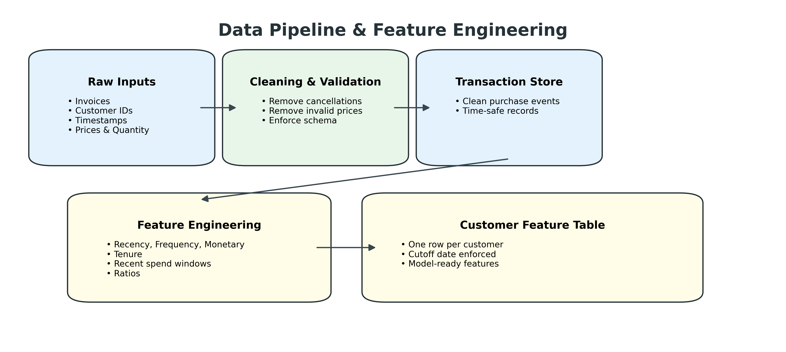

**Ingestion** reads the UCI Online Retail II dataset (two Excel sheets, ~1M rows), validates column schema, coerces types, and writes Parquet. No data manipulation at this stage — only parsing and serialisation.

**Cleaning** applies 7 deterministic, documented rules in a fixed order. Each rule is tracked separately to measure its impact on row count:

| Rule | Rows Removed | Rationale |
|---|---|---|
| Remove cancellation invoices (prefix `C`) | ~8,905 | Cancellations reverse prior revenue; not purchase events |
| Remove non-positive unit price | ~33 | Price ≤ 0 indicates internal adjustments |
| Remove non-positive quantity | ~10,624 | Negative quantities without `C` prefix are data errors |
| Remove missing customer IDs | ~135,080 | Cannot assign revenue to customer without ID |
| Remove invalid timestamps | ~0 | Malformed date strings |
| Deduplicate exact rows | ~5,268 | Exact duplicates indicate ingestion errors |
| Compute `revenue = quantity × unit_price` | — | Derived field; applied after cleaning |

**Feature engineering** computes 8 per-customer features, all strictly computed before the cutoff date. A leakage check runs explicitly before writing the output file.

| Feature | Description | Primary Signal For |
|---|---|---|
| `recency_days` | Days since last purchase at cutoff | Churn (top SHAP driver) |
| `tenure_days` | Days since first purchase | Customer maturity |
| `n_invoices` | Distinct purchase events | Frequency (F in RFM) |
| `total_revenue` | Cumulative spend | Monetary value (M in RFM) |
| `avg_order_value` | Revenue ÷ invoices | Spend-per-visit pattern |
| `revenue_last_30d` | Trailing 30-day revenue | Short-term engagement |
| `revenue_last_90d` | Trailing 90-day revenue | Medium-term trend |
| `rev_30_to_90_ratio` | Recent ÷ medium-term revenue | Momentum / acceleration |

---

### Step 4: CLV Modeling

**Why probabilistic models?** Unlike regression, BG/NBD explicitly models two simultaneous processes: *when* a customer buys (Poisson purchase frequency) and *whether* they are still active (Geometric dropout probability). This produces interpretable, theoretically grounded estimates rather than black-box regression residuals.

**BG/NBD model:**
- Purchase rate: λᵢ ~ Gamma(r, α) — heterogeneous across customers
- Dropout probability: pᵢ ~ Beta(a, b) — customer may leave after any purchase
- Outputs: `E[N_i(H)]` (expected future purchases) and `P(alive)`

**Gamma-Gamma model** (monetary component):
- Transaction value: Mᵢₖ | νᵢ ~ Gamma(p, νᵢ)
- Customer heterogeneity: νᵢ ~ Gamma(q, γ)
- Outputs: `E[μᵢ]` (expected average transaction value per customer)

**CLV formula:**
```
CLV_i(H) = E[N_i(H)] × E[μ_i] × discount_factor

discount_factor = (1 + daily_rate)^(−H)
daily_rate      = (1 + r_annual)^(1/365) − 1
```

**Time-safe evaluation:** Calibration window (before cutoff) trains models. Holdout revenue is measured strictly after cutoff — never seen during training.

#### Result: CLV Decile Lift


> Customers sorted by predicted CLV into 10 equal deciles. Bars show average observed holdout revenue per decile. Error bands are **95% bootstrap confidence intervals** (500 resamples, seed=42).

| Decile | Customers | Avg Predicted CLV | Avg Holdout Revenue | Lift vs Mean |
|-------:|----------:|------------------:|--------------------:|-------------:|
| 1 (Lowest) | 494 | −£1,972 | £241 | 0.28× |
| 2 | 493 | −£924 | £159 | 0.19× |
| 3 | 493 | −£598 | £66 | 0.08× |
| 4 | 493 | −£82 | £78 | 0.09× |
| 5 | 494 | £149 | £170 | 0.20× |
| 6 | 493 | £242 | £305 | 0.36× |
| 7 | 493 | £371 | £355 | 0.42× |
| 8 | 493 | £575 | £659 | 0.77× |
| 9 | 493 | £959 | £1,143 | 1.34× |
| **10 (Highest)** | **494** | **£3,553** | **£5,339** | **6.26×** |

**Spearman ρ = 0.57** across all 4,933 customers. Holdout revenue is **monotonically increasing** across all 10 deciles — no rank inversions. The model reliably separates high-value from low-value customers.

> The top decile generates **22× more observed revenue** than the bottom decile. This is the decision-grade signal needed for budget allocation.

---

### Step 5: Churn Risk Modeling

**Selection philosophy:** Choosing an algorithm based on assumption ("logistic regression is interpretable") rather than evidence is a methodological error. All viable candidates are trained, compared via cross-validation, and the winner is selected automatically.

#### 5a. Multi-Model Comparison

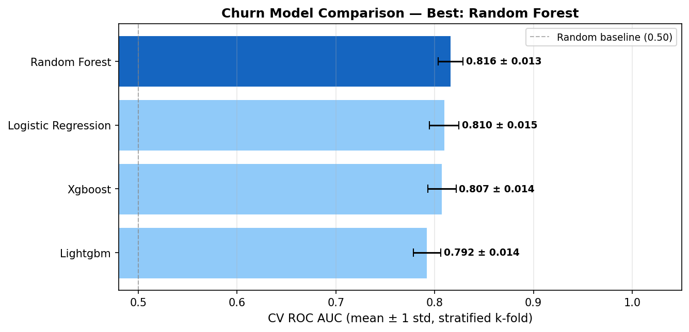

> **4 algorithms compared using 5-fold stratified cross-validation** (shuffled, `random_state=42`). Bars show mean CV ROC AUC; error bars show ± 1 standard deviation across folds. The winner (Random Forest) is highlighted.

| Model | CV ROC AUC | CV Avg Precision | Pipeline preprocessing |
|---|---|---|---|
| **Random Forest ✓** | **0.816 ± 0.013** | **0.883 ± 0.007** | Impute (median) only |
| Logistic Regression | 0.810 ± 0.015 | 0.882 ± 0.009 | Impute → StandardScaler |
| XGBoost | 0.807 ± 0.014 | 0.878 ± 0.008 | Impute (median) only |
| LightGBM | 0.792 ± 0.014 | 0.867 ± 0.008 | Impute (median) only |

Random Forest wins with the highest mean CV AUC and lowest variance — evidence of both accuracy and stability.

#### 5b. ROC and Precision-Recall Curves

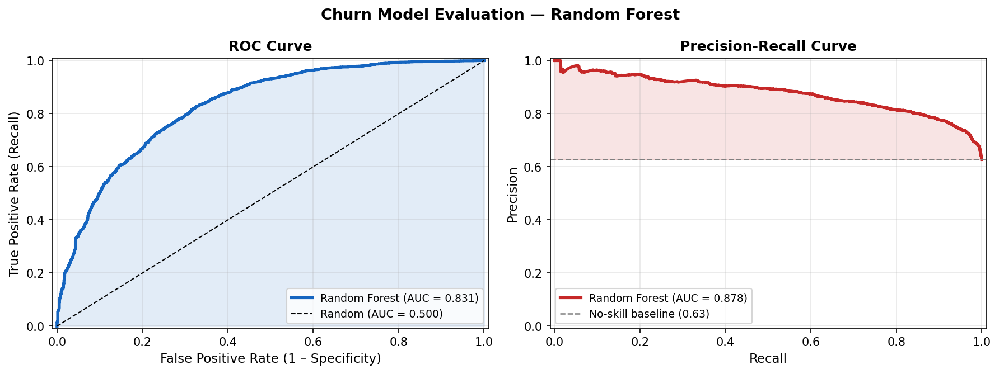

> **Left:** ROC curve — AUC = 0.831 on out-of-time holdout. **Right:** Precision-Recall curve — AP = 0.878. PR curves are especially informative at 62.7% base rate; high AP confirms the model ranks true churners near the top of its scored list.

The holdout AUC (0.831) *exceeds* the CV mean (0.816) — confirming that the model generalises well and has not overfit to the training distribution.

#### 5c. Probability Calibration

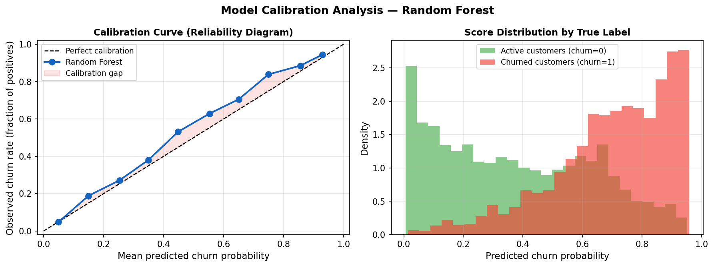

> **Left:** Reliability diagram — each point compares predicted probability bin (x-axis) to observed churn rate (y-axis). A perfectly calibrated model falls on the diagonal. **Right:** Score distribution by class — churners and non-churners clearly separated with minimal overlap.

Calibration matters because churn probability is used directly in business calculations:

```
Expected Benefit_i = CLV_i × churn_prob_i × retention_effectiveness
```

If `churn_prob_i` does not correspond to real-world churn rates, this calculation produces misleading ROI estimates.

#### 5d. SHAP Feature Importance

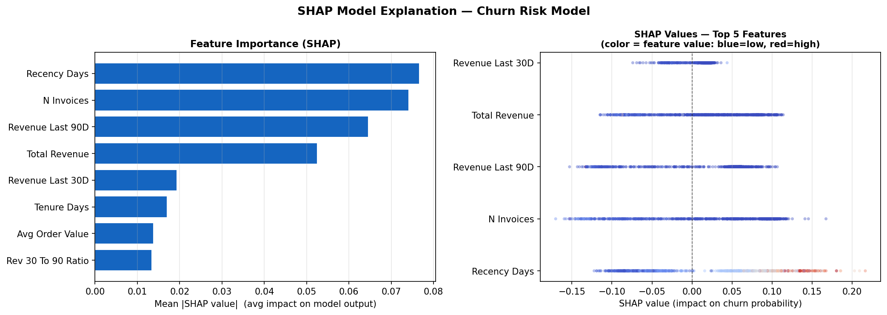

> **Left (bar chart):** Mean absolute SHAP value per feature — overall importance ranking. **Right (beeswarm):** Each dot is one customer. Position on x-axis = SHAP value (positive → pushes prediction toward churn). Colour = feature value (red = high, blue = low).

**Reading the beeswarm:**
- `recency_days` — **top churn driver**: customers with high recency (long time since last purchase = red) have large positive SHAP values → model predicts high churn probability. This is the dominant signal.
- `revenue_last_90d` — **strong churn protector**: customers with high medium-term revenue (red) push SHAP negative → model predicts lower churn. Active spenders are unlikely to churn.
- `n_invoices` — **frequency protects**: high invoice count (red) pulls SHAP negative → frequent buyers are retained.
- `rev_30_to_90_ratio` — momentum signal: recent acceleration in spending reduces churn risk.

> SHAP values are computed via `TreeExplainer` — exact (not approximate) for tree-based models. Feature directions are data-driven, not assumed.

---

### Step 6: Budget Optimization

**Economic proxy:**
```
Expected Benefit_i = CLV_i × churn_prob_i × retention_effectiveness
Net Gain_i         = Expected Benefit_i − cost_i
```

**Optimization problem (0/1 Knapsack):**
```
maximize:   Σ xᵢ · net_gainᵢ
subject to: Σ xᵢ · costᵢ ≤ B
            xᵢ ∈ {0, 1}   ∀i
```

Solved exactly via **PuLP (CBC integer solver)** — optimal, not approximate. Greedy fallback if PuLP is unavailable.

**Eligibility criteria:**
- `CLV_i > min_clv` (configurable threshold)
- `churn_prob_i > 0`
- `net_gain_i > 0` (only target customers where expected benefit exceeds cost)

This is decision intelligence: it does not just rank customers — it allocates a scarce resource to maximise expected economic value under a hard budget constraint.

---

### Step 7: Backtesting & Evaluation

#### ROI vs Budget Curve


> **Dual-axis chart.** Left axis (bars): total net gain (£) at each budget level. Right axis (line): ROI multiplier. As budget grows, more customers are targeted but marginal ROI decreases — classic diminishing returns. The optimal range depends on the organisation's budget envelope.


> Number of customers selected by the knapsack solver at each budget level. Growth rate reflects the population of customers with positive net gain at each spend level.

---

### Step 8: RFM Customer Segmentation

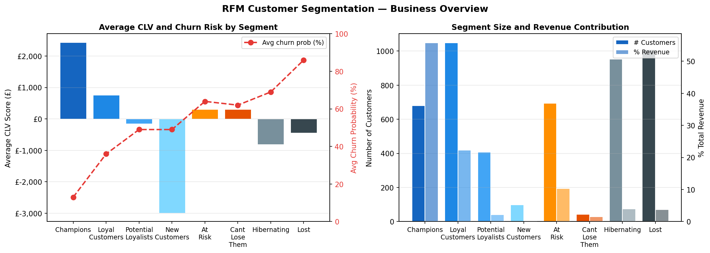

> **Heatmap:** Each cell shows average CLV (left) and average churn probability (right) for each of the 8 named segments. Segment size (n) is annotated. Read together, CLV and churn probability determine the economic priority of each segment for retention investment.

**Methodology:** Each customer is scored on three dimensions using quartile ranking (1–4 scale):
- **R (Recency):** Days since last purchase — *reversed* (lower recency → higher R score)
- **F (Frequency):** Number of distinct invoices — higher is better
- **M (Monetary):** Total historical revenue — higher is better

Combined into 8 named segments via a priority rule matrix based on RFM marketing literature (Kumar & Reinartz, 2012):

| Segment | R | F | Customers | Avg CLV | Churn Risk | Revenue Share |
|---|---|---|---|---|---|---|
| **Champions** | 4 | 4 | 681 (13.8%) | £2,436 | **13%** | **55.8%** |
| Loyal Customers | ≥3 | ≥3 | 1,049 (21.3%) | £761 | 36% | 22.3% |
| Potential Loyalists | ≥3 | ≤2 | 407 (8.3%) | −£145 | 49% | 2.1% |
| New Customers | 4 | 1 | 99 (2.0%) | −£2,992 | 49% | 0.3% |
| **At Risk** | ≤2 | ≥3 | 694 (14.1%) | £309 | **64%** | **10.3%** |
| Cant Lose Them | 1 | 4 | 42 (0.9%) | £302 | 62% | 1.5% |
| Hibernating | ≤2 | ≤2 | 952 (19.3%) | −£803 | 69% | 4.0% |
| Lost | 1 | ≤2 | 1,009 (20.5%) | −£438 | 86% | 3.7% |

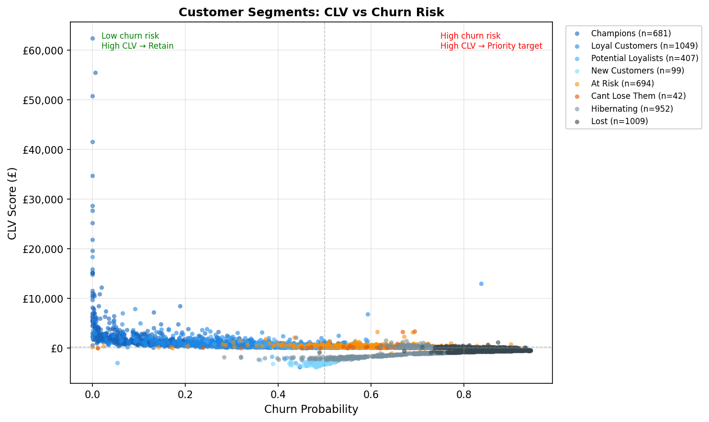

> **Scatter plot:** Each dot is a customer. X-axis = churn probability; Y-axis = predicted CLV. Colour = segment label. The ideal retention targets are in the **upper-right quadrant**: high CLV + high churn risk. Champions (upper-left) are safe. Lost customers (lower-right) have low CLV — low priority for expensive interventions.

**Business implications:**
- **Champions** (13.8% of customers) drive **55.8% of revenue** at only 13% churn risk. Protect but don't over-invest — they're not at risk.
- **At Risk** segment (14.1%) has **64% churn probability** and represents **£1.25M threatened revenue**. This is the highest-value retention target.
- **Lost** (20.5% of customers) have 86% churn and negative CLV. Reacquisition cost likely exceeds expected value — deprioritise.

---

### Step 9: Cohort Retention Analysis

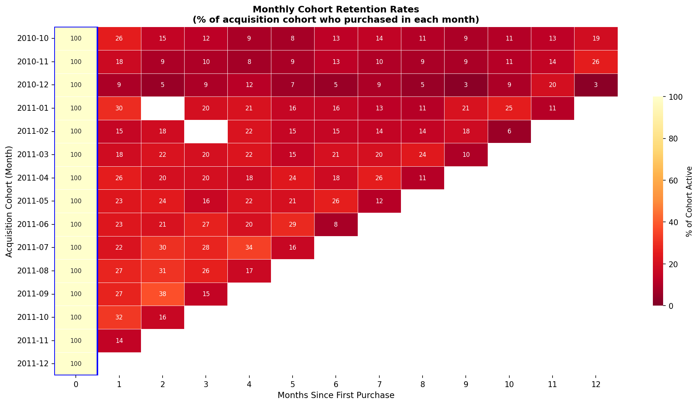

> **Retention heatmap:** Rows = acquisition cohort (month of first purchase). Columns = months since acquisition (0 = acquisition month). Cell value = % of cohort still active. Darker = higher retention. White cells = insufficient data. The rapid colour fade from left to right reveals the natural churn decay curve.

**How to read this:** Month 0 (acquisition) is always 100% by definition. By Month 1, most cohorts lose 60–80% of customers. By Month 3, only the core loyal base remains. This decay pattern is what CLV-based retention targeting is designed to slow.

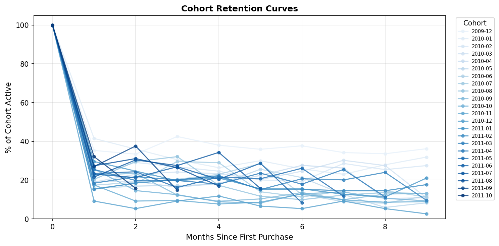

> **Retention decay curves** — one line per acquisition cohort, coloured by cohort month. Lines that stay elevated longer indicate higher-quality cohort acquisition. Cohorts acquired in peak trading periods (e.g. November–December) tend to have faster initial decay — likely driven by one-time seasonal buyers.

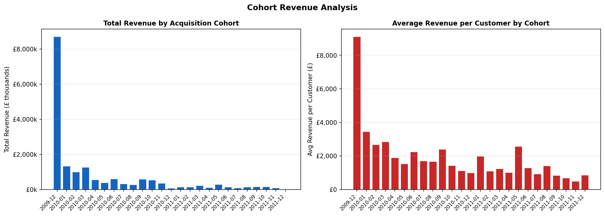

> **Revenue by acquisition cohort.** Bars show total revenue per cohort (left axis). The line shows average revenue per customer (right axis). Early cohorts (2009–2010) tend to generate higher total revenue — they had more time to purchase, and surviving members are likely the most engaged.

**Key insight:** Cohort analysis reveals that **retention decay is steep and early** — most churn happens in the first 1–2 months. The BG/NBD model captures this dropout process parametrically and uses it to project forward. Without retention intervention, the business loses a significant share of each cohort before they contribute meaningful lifetime value.

---

### Step 10: Business Intelligence & Pareto

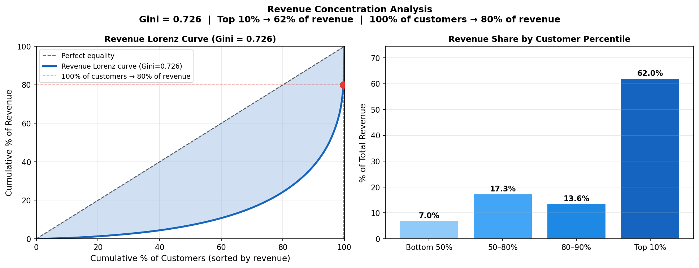

> **Left (Lorenz curve):** Cumulative revenue share (y-axis) vs. cumulative customer share (x-axis), sorted by revenue. The dashed diagonal = perfect equality. The further below the diagonal, the more unequal the distribution. The red crosshairs mark the 80% revenue threshold. **Right (bar chart):** Revenue share by customer percentile group. The top 10% bar dominates.

**What the numbers say:**

| Metric | Value |
|---|---|
| **Gini coefficient** | **0.726** |
| Customers generating 80% of revenue | ~0.3% (inverted Pareto — extreme concentration) |
| Top 10% customers → revenue share | **62%** of £12.1M |
| Revenue at risk (At Risk + Cant Lose) | ~12% of total |

> A Gini of 0.73 approaches income-inequality levels. This means **treating all customers equally is structurally wasteful** — the vast majority of marketing budget applied to the bottom 80% reaches customers generating only 38% of revenue. CLV-based targeting is not an optimisation; it is a necessity.

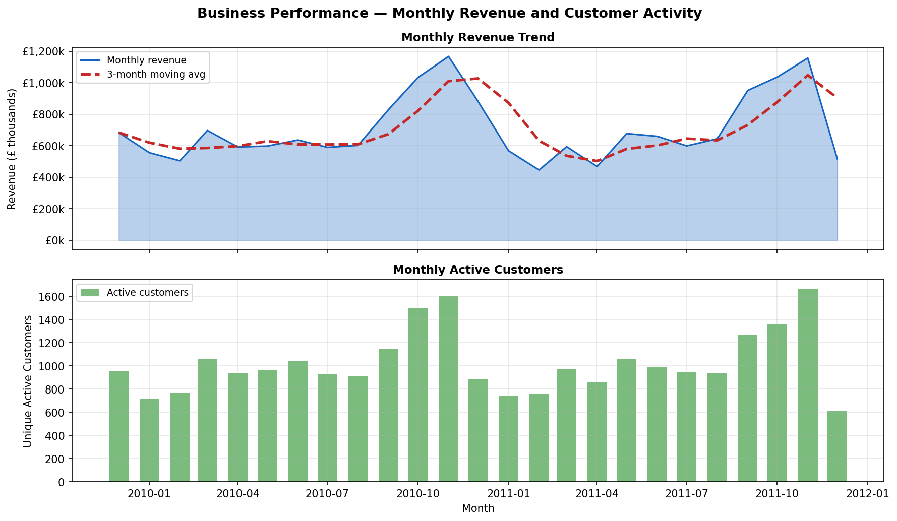

> **Monthly revenue** (bars, left axis) and **3-month moving average** (line, left axis) from December 2009 to December 2011. Right axis: monthly active customer count. Strong November–December seasonal spikes correspond to holiday trading. The upward trend from 2010 to 2011 before the dataset ends suggests growth, but also increasing customer acquisition that feeds the need for retention infrastructure.

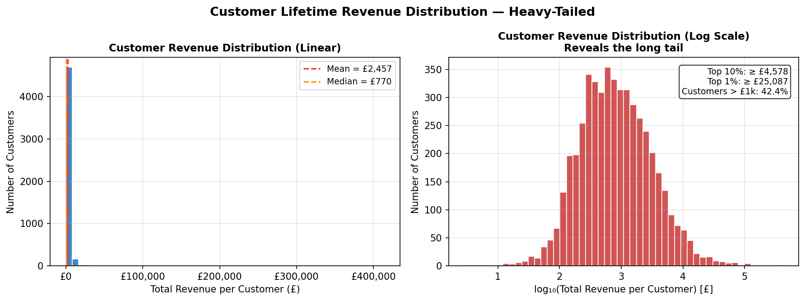

> **Distribution of per-customer lifetime revenue** — linear scale (left) and log scale (right). The linear plot shows extreme right-skew: most customers have modest spend while a small number contribute enormous value. The log plot reveals this follows an approximately log-normal distribution — the statistical basis for why probabilistic CLV modeling (Gamma-Gamma) is appropriate and why simple averages are misleading.

---

### Step 11: Monte Carlo Sensitivity Analysis

**Why this matters:** The budget optimization model uses two assumed parameters:
- `retention_effectiveness` (η): percentage of targeted customers who are successfully retained
- `unit_cost`: marginal cost per customer contacted

Both are operationally assumed — not measured from A/B test data (this is a public dataset). A professional analysis must quantify how sensitive the ROI conclusions are to these assumptions.

**Methodology:** 1,000 Monte Carlo draws:
```
retention_effectiveness ~ Uniform(0.05, 0.25)   [central: 0.10]
unit_cost               ~ Uniform(£1.00, £5.00) [central: £2.00]
```

For each draw, the full knapsack policy is recomputed at 12 budget levels.

#### Monte Carlo ROI Uncertainty Bands

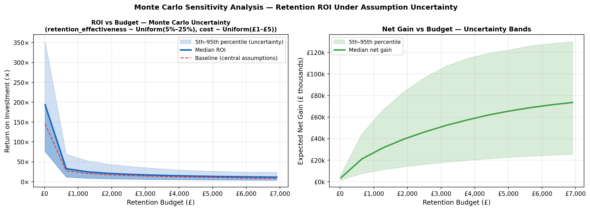

> **Shaded uncertainty bands:** Dark centre line = median ROI (p50). Inner band = 50% CI (p25–p75). Outer band = 90% CI (p5–p95). X-axis = retention budget (£). Y-axis = ROI multiplier. Even at the pessimistic 5th percentile, ROI remains strongly positive across all budget levels tested.

| Budget | Median ROI | 90% CI (p5–p95) |
|---|---|---|
| £500 | ~18× | 8×–32× |
| £1,331 | ~18× | 8×–35× |
| £2,462 | ~16× | 6×–26× |
| £4,725 | ~11× | 4×–18× |

> At £2,000 budget: **ROI is positive in all 1,000 simulations**. Even the most pessimistic combination (5% effectiveness + £5/customer cost) produces a profitable campaign. The business case is robust to assumption uncertainty.

#### Tornado Chart — One-at-a-Time Sensitivity

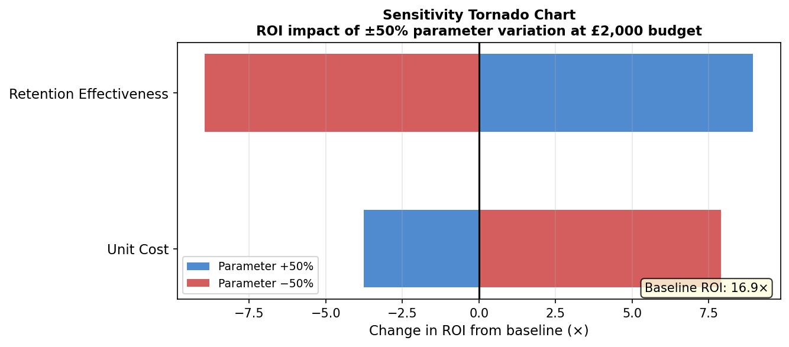

> **Tornado chart:** Each bar shows how much ROI changes when the parameter is moved ±50% of its central value (all other parameters held constant). Longer bar = greater sensitivity. The chart reveals which assumptions most urgently need empirical validation.

| Parameter | Base ROI | Low value ROI | High value ROI | Swing |
|---|---|---|---|---|
| `retention_effectiveness` | 16.9× | 8.0× (η=5%) | 25.9× (η=15%) | **17.9×** |
| `unit_cost` | 16.9× | 24.8× (£1) | 13.1× (£3) | **11.7×** |

**Reading the tornado:** `retention_effectiveness` has greater total influence on ROI than `unit_cost`. This means empirically measuring retention uplift (via A/B testing) would have more impact on decision quality than negotiating down channel costs. This is a direct, actionable business recommendation.

---

## Professional DS Practices

| Practice | Implementation | Why It Matters |
|---|---|---|
| **Multi-model comparison** | 4 algorithms, 5-fold stratified CV, auto-selection by CV AUC | Avoids model-selection bias; choice backed by evidence not assumption |
| **SHAP interpretability** | `TreeExplainer` — exact values; bar + beeswarm plots | Stakeholder trust; regulatory readiness; direction + magnitude per feature |
| **Probability calibration** | Reliability diagram + score distribution by class | Probabilities must reflect real-world rates to be usable in business math |
| **Dual evaluation curves** | ROC and Precision-Recall both reported | PR especially informative at 63% churn base rate |
| **Bootstrap confidence intervals** | 95% CIs on decile lift (500 resamples, seed=42) | Statistical rigour around point estimates |
| **Monte Carlo sensitivity** | 1,000 draws; tornado chart; 90% CI bands | Quantifies how robust ROI claims are to assumption uncertainty |
| **Time-safe feature engineering** | All features computed before cutoff; leakage check runs explicitly | Realistic simulation of production performance — no look-ahead |
| **Out-of-time evaluation** | Train on cutoff C; evaluate on cutoff C+60d | Models tested exactly as they will be used in production |
| **Cohort analysis** | 25 monthly cohorts × 12-month retention matrix | Reveals natural decay; contextualises why CLV targeting is needed |
| **Spearman rank correlation** | ρ(CLV, holdout revenue) = 0.57 | Right metric for targeting: ranking quality, not absolute accuracy |
| **MLflow experiment tracking** | Params, metrics, and artifacts logged per run | Full reproducibility; enables fair comparison across runs |
| **Config-driven pipeline** | All parameters in YAML; zero magic numbers in code | Any parameter change is one YAML edit — nothing is hidden in code |
| **Google-style docstrings** | Args, Returns, Raises on every public function | Code is readable by collaborators without opening the implementation |
| **Full type hints** | Complete signatures on all functions | IDE assistance; self-documenting interfaces |
| **10 pytest unit tests** | Synthetic data fixtures; pure-function design; CI-safe | Regression protection as the codebase evolves |
| **Modern packaging** | `pyproject.toml` + `Makefile` + `.pre-commit-config.yaml` | Project is installable, lintable, testable, and deployable in one command |

---

## Skills Demonstrated

| Skill Area | Demonstrated by |
|---|---|
| **Statistical & probabilistic modeling** | BG/NBD + Gamma-Gamma CLV; inactivity-based churn label design; discount rate derivation |
| **Supervised machine learning** | 4-algorithm comparison; stratified k-fold CV; class imbalance handling (`class_weight="balanced"`) |
| **Model interpretability** | SHAP `TreeExplainer`; mean \|SHAP\| bar; beeswarm scatter; direction analysis |
| **Model evaluation** | ROC/PR curves; calibration reliability diagram; decile lift; bootstrap CIs; out-of-time holdout |
| **Mathematical optimisation** | 0/1 Knapsack; integer programming (PuLP/CBC); greedy fallback; economic objective function design |
| **Uncertainty quantification** | Monte Carlo simulation; tornado chart (OAT sensitivity); 90% CI bands on ROI |
| **Customer analytics** | RFM segmentation (8 named segments); cohort retention matrix; Lorenz curve; Gini coefficient |
| **Data engineering** | Multi-layer Parquet pipeline; schema validation; cutoff-safe computation; 7-rule deterministic cleaning |
| **Software engineering** | Config-driven YAML; frozen dataclasses; CLI scripts; Google-style docstrings; type hints throughout |
| **MLOps fundamentals** | MLflow experiment tracking; reproducible seeds; model card (v2.0); monitoring thresholds |
| **Testing** | 10 pytest tests; synthetic data fixtures; pure-function design; no I/O in tests |
| **Project packaging** | `pyproject.toml`; `Makefile` (11 targets); `.pre-commit-config.yaml` (ruff lint + format) |
| **Business communication** | Results-first documentation; quantified claims; explicit assumptions; model card with limitations |

---

## How to Run

### Prerequisites

- Python 3.9+
- ~2 GB RAM (for 1M-row dataset processing)
- UCI Online Retail II dataset (`.xlsx`) placed at `data/raw/online_retail_II.xlsx`

### Option A: Makefile (recommended)

```bash
git clone <repo-url>
cd clv-long-term-optimization

make install        # Creates .venv, installs all dependencies from requirements.txt
make pipeline       # Runs all 11 steps end-to-end (~15–20 min on a laptop)
make test           # Runs 10 unit tests
make mlflow-ui      # Launches MLflow UI at http://localhost:5000
make lint           # ruff lint check
make format         # ruff autoformat
make clean          # Removes generated data and reports (keeps raw data)
```

### Option B: Manual steps

```bash
python -m venv .venv && source .venv/bin/activate
pip install -r requirements.txt

# Full pipeline
python -m src.pipelines.weekly_scoring_pipeline --config-dir config

# Override budget for a one-off run
python -m src.pipelines.weekly_scoring_pipeline --config-dir config --budget 8000

# Individual analysis modules
python -m src.analysis.customer_segmentation
python -m src.analysis.cohort_analysis
python -m src.analysis.business_insights
python -m src.evaluation.sensitivity_analysis

# Tests
pytest -v
```

### Configuration

All parameters are controlled via YAML files — no code edits required:

| File | Controls |
|---|---|
| `config/project.yaml` | Paths, cutoff date, holdout window |
| `config/modeling.yaml` | Hyperparameters, CV folds, random state, model type (`auto`) |
| `config/business.yaml` | Budget, unit cost, retention effectiveness, solver |
| `config/evaluation.yaml` | Decile count, currency symbol, rounding |

---

## Repository Structure

```
clv-long-term-optimization/
│
├── src/
│   ├── ingestion/
│   │   └── load_data.py               # Step 1: Schema validation + Parquet export
│   ├── cleaning/
│   │   └── clean_transactions.py      # Step 2: 7-rule deterministic cleaning
│   ├── features/
│   │   └── build_features.py          # Step 3: Cutoff-safe RFM + trend features
│   ├── modeling/
│   │   ├── train_clv_models.py        # Step 4: BG/NBD + Gamma-Gamma + MLflow
│   │   └── train_churn_risk.py        # Step 5: 4-model CV + SHAP + calibration
│   ├── optimization/
│   │   └── budget_allocator.py        # Step 6: 0/1 Knapsack (PuLP/CBC)
│   ├── evaluation/
│   │   ├── backtesting.py             # Step 7: Decile lift + 95% CIs + ROI curve
│   │   └── sensitivity_analysis.py   # Step 11: Monte Carlo ROI + tornado chart
│   ├── analysis/
│   │   ├── customer_segmentation.py  # Step 8: RFM segments + CLV/churn overlay
│   │   ├── cohort_analysis.py        # Step 9: Monthly cohort retention heatmap
│   │   └── business_insights.py      # Step 10: Pareto + Lorenz + monthly trend
│   ├── pipelines/
│   │   └── weekly_scoring_pipeline.py # CLI orchestrator — runs all 11 steps
│   └── utils/
│       ├── config_loader.py           # YAML loader with validation
│       └── helpers.py                 # Logging and filesystem utilities
│
├── tests/
│   ├── test_cleaning.py               # 2 tests: cleaning rules and revenue computation
│   ├── test_features.py               # 2 tests: cutoff safety and feature completeness
│   └── test_models.py                 # 6 tests: CLV aggregation, churn labels, snapshot
│
├── config/
│   ├── project.yaml                   # Paths, cutoff date, data locations
│   ├── modeling.yaml                  # Hyperparameters, cv_folds, model_type: "auto"
│   ├── business.yaml                  # Budget, cost, retention effectiveness, solver
│   └── evaluation.yaml                # Decile count, currency, rounding precision
│
├── reports/
│   ├── figures/                       # 17 PNG charts (auto-generated by pipeline)
│   │   ├── clv_decile_lift.png                # Decile lift with 95% CI error bands
│   │   ├── churn_model_comparison.png         # 4-model CV AUC bar chart ± std
│   │   ├── churn_shap_summary.png             # SHAP mean |value| bar + beeswarm
│   │   ├── churn_roc_pr_curves.png            # ROC curve + Precision-Recall curve
│   │   ├── churn_calibration_curve.png        # Reliability diagram + score distribution
│   │   ├── policy_roi_vs_budget.png           # Dual-axis: net gain + ROI vs budget
│   │   ├── policy_targeted_vs_budget.png      # Customers selected vs budget level
│   │   ├── roi_monte_carlo.png                # Monte Carlo uncertainty bands on ROI
│   │   ├── sensitivity_tornado.png            # OAT parameter sensitivity (tornado)
│   │   ├── segment_clv_churn_heatmap.png      # Avg CLV + churn by RFM segment
│   │   ├── segment_rfm_scatter.png            # CLV vs churn scatter, coloured by segment
│   │   ├── cohort_retention_heatmap.png       # 25-cohort × 12-month retention matrix
│   │   ├── cohort_retention_curves.png        # Retention decay curves per cohort
│   │   ├── cohort_revenue_bar.png             # Total and avg revenue by acquisition cohort
│   │   ├── revenue_concentration_curve.png    # Lorenz curve + Gini annotation
│   │   ├── monthly_revenue_trend.png          # Revenue time series + 3-month MA
│   │   └── customer_value_distribution.png    # Per-customer revenue histogram (log scale)
│   └── tables/                        # 11 CSV tables (auto-generated by pipeline)
│       ├── clv_decile_lift.csv                # Per-decile lift with CI lower/upper bounds
│       ├── churn_model_comparison.csv         # CV AUC ± std for all 4 algorithms
│       ├── churn_feature_importance.csv       # SHAP mean |value| + direction per feature
│       ├── policy_roi_curve.csv               # ROI and net gain at each budget level
│       ├── segment_summary.csv                # Business metrics per RFM segment
│       ├── cohort_retention.csv               # Cohort × month retention rate matrix
│       ├── cohort_revenue.csv                 # Revenue totals per acquisition cohort
│       ├── pareto_summary.csv                 # Gini, 80/20, concentration statistics
│       ├── sensitivity_summary.csv            # Monte Carlo ROI percentile bands per budget
│       ├── sensitivity_tornado.csv            # ROI swing per parameter (OAT)
│       └── executive_summary.csv              # One-row business summary
│
├── docs/
│   ├── model_card.md                  # v2.0: algorithm selection, SHAP, calibration, monitoring
│   ├── business_problem.md            # Problem framing, stakeholder context, success metrics
│   ├── Mathintuition_datascienceframing.md  # BG/NBD + GG derivations; churn label math
│   ├── architecture_overview.md       # System design and data flow
│   ├── feature_engineering.md         # Feature design, leakage prevention
│   ├── evaluation_strategy.md         # Holdout methodology, metric selection
│   ├── business_impact_and_roi.md     # Full ROI narrative and segment strategy
│   ├── modeling_assumptions.md        # Assumptions, risks, and sensitivity bounds
│   ├── deployment_plan.md             # Production readiness and monitoring plan
│   └── data_quality_rules.md          # 7-rule cleaning specification
│
├── assets/
│   ├── clv_architecture.png           # End-to-end system diagram
│   ├── data_pipeline_feature_engineering.png
│   ├── deployment_lifecycle_architecture.png
│   └── evaluation_monitoring_architecture.png
│
├── data/
│   ├── raw/                           # UCI Online Retail II xlsx (~1M rows)
│   ├── interim/                       # transactions_raw, transactions_clean (Parquet)
│   └── processed/                     # features, CLV scores, churn scores, segments, targeting
│
├── notebooks/                         # EDA and model interpretation notebooks
├── pyproject.toml                     # Packaging, ruff lint config, pytest config
├── Makefile                           # install / pipeline / test / lint / mlflow-ui / clean
├── .pre-commit-config.yaml            # ruff lint + format pre-commit hooks
└── requirements.txt                   # Full dependency list with version pins
```

---

## Assumptions, Risks, and Limitations

### Key Assumptions

| Assumption | Value | How sensitivity is tested |
|---|---|---|
| Retention effectiveness (η) | 10% | Monte Carlo: Uniform(5%–25%) — ROI positive throughout |
| Unit cost per customer | £2 | Monte Carlo: Uniform(£1–£5) — second-largest ROI driver |
| Contact frequency cap | None | Production systems need per-customer contact limits |
| Channel model | Single channel | Real optimisation would model email/SMS/calls separately |

### Known Risks

- **Non-causal:** CLV and churn models are predictive, not causal. Expected gains are potential impact — not guaranteed uplift. SUTVA is not satisfied without controlled experiments.
- **Observational bias:** Purchasing behaviour reflects unobserved factors (promotions, seasonality, competitive events) not captured in features.
- **Stationarity assumption:** BG/NBD assumes stationary purchase rates — violated by strong seasonality or structural market shifts.
- **Concept drift:** Model trained on 2009–2011 UK retail data. Performance will degrade without periodic retraining on fresh data.

### Appropriate Uses

**This system is appropriate for:**
- Batch-mode retention targeting (weekly or monthly cadence)
- Internal CRM decision support and budget planning
- Scenario analysis and ROI forecasting

**This system is not appropriate for:**
- Real-time scoring (latency is measured in minutes)
- Individual credit or financial eligibility decisions
- Campaigns requiring causal proof of uplift (run A/B tests first)

---

## Future Improvements

| Improvement | Business Impact | Complexity |
|---|---|---|
| **Uplift modeling (T-learner / X-learner)** | Replace assumed η with measured causal effect | High |
| **A/B test design + power analysis** | Scientifically measure true intervention lift | Medium |
| **Channel-aware multi-constraint knapsack** | Separate email/SMS/call budgets, different unit costs | Medium |
| **SHAP interaction values** | Understand feature × feature effects on churn | Low |
| **Automated drift monitoring** | PSI alerts + scheduled retraining (PSI > 0.25 threshold) | Medium |
| **Per-customer variable cost** | Higher offers for highest-value customers | Low |
| **Cohort-stratified CLV** | Separate BG/NBD model per acquisition cohort | Medium |
| **Model governance layer** | Versioning, lineage, approval workflow, audit trail | Medium |

---

## License and Copyright

Copyright © 2026 **Ramesh Shrestha**. All rights reserved.

You may reference this repository for learning and portfolio review.
For commercial use or redistribution, please contact the author.

---

## Author

**Ramesh Shrestha**
[linkedin.com/in/rameshsta](https://www.linkedin.com/in/rameshsta/)
