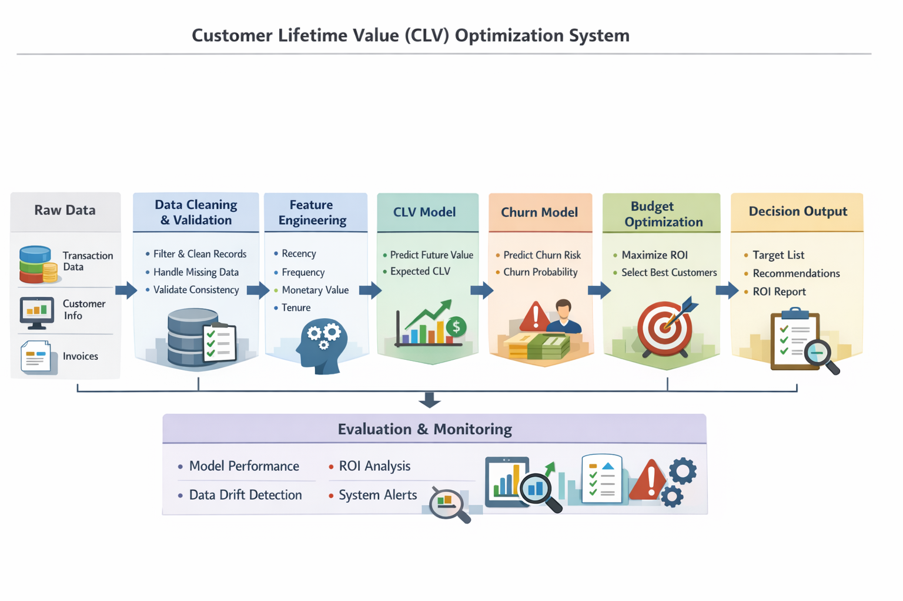
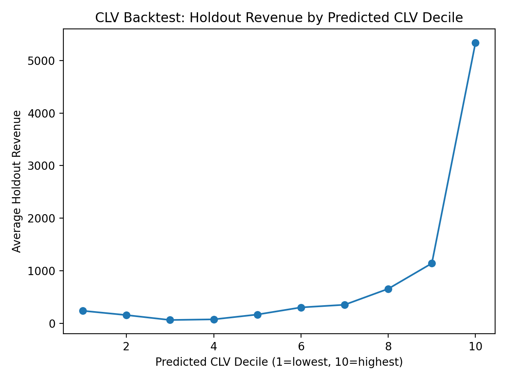
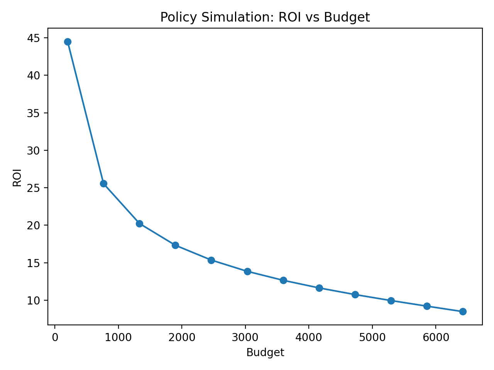
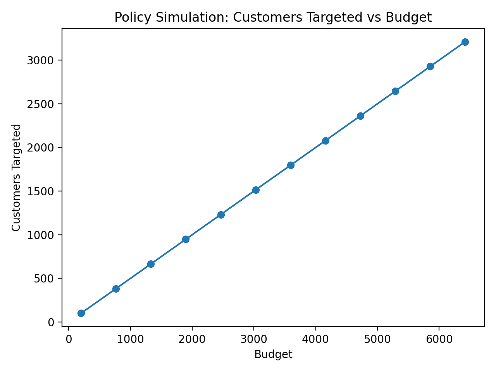

# Customer Lifetime Value (CLV) with Long-Term Optimization  
**A production-style decision intelligence system for retention targeting under budget constraints**

**Author:** Ramesh Shrestha  
**LinkedIn:** https://www.linkedin.com/in/rameshsta/

---

## Table of Contents
- [Customer Lifetime Value (CLV) with Long-Term Optimization](#customer-lifetime-value-clv-with-long-term-optimization)
  - [Table of Contents](#table-of-contents)
  - [Project Summary](#project-summary)
  - [Business Context](#business-context)
  - [What This System Delivers](#what-this-system-delivers)
    - [Outputs produced by the pipeline](#outputs-produced-by-the-pipeline)
    - [Why this is realistic](#why-this-is-realistic)
  - [Dataset](#dataset)
  - [End-to-End System Architecture](#end-to-end-system-architecture)
  - [Approach and Methods](#approach-and-methods)
    - [Step 1 — Ingestion](#step-1--ingestion)
    - [Step 2 — Cleaning](#step-2--cleaning)
    - [Step 3 — Feature Engineering](#step-3--feature-engineering)
    - [Step 4 — CLV Modeling](#step-4--clv-modeling)
    - [Step 5 — Churn Risk Modeling](#step-5--churn-risk-modeling)
    - [Step 6 — Budget Optimization](#step-6--budget-optimization)
  - [Step 7 — Evaluation and Reporting](#step-7--evaluation-and-reporting)
  - [7.1 Evaluation Artifacts Overview](#71-evaluation-artifacts-overview)
  - [7.2 CLV Model Validation — Decile Lift Analysis](#72-clv-model-validation--decile-lift-analysis)
    - [Figure: CLV Decile Lift](#figure-clv-decile-lift)
    - [Supporting Table: CLV Decile Lift](#supporting-table-clv-decile-lift)
    - [Interpretation](#interpretation)
  - [7.3 Policy Evaluation — ROI vs Budget](#73-policy-evaluation--roi-vs-budget)
    - [Figure: ROI vs Budget](#figure-roi-vs-budget)
    - [Supporting Table: Policy ROI Curve](#supporting-table-policy-roi-curve)
    - [Interpretation](#interpretation-1)
  - [7.4 Operational Impact — Customers Targeted vs Budget](#74-operational-impact--customers-targeted-vs-budget)
    - [Figure: Targeted Customers vs Budget](#figure-targeted-customers-vs-budget)
    - [Interpretation](#interpretation-2)
  - [7.5 Executive Summary — Business-Level Results](#75-executive-summary--business-level-results)
    - [Table: Executive Summary](#table-executive-summary)
    - [Interpretation](#interpretation-3)
  - [7.6 Why This Evaluation Is Business-Credible](#76-why-this-evaluation-is-business-credible)
  - [7.7 Outcome of Step 7](#77-outcome-of-step-7)
    - [Step 8 — Packaging and Reproducibility](#step-8--packaging-and-reproducibility)
  - [Results and Evidence](#results-and-evidence)
    - [CLV lift (holdout validation)](#clv-lift-holdout-validation)
    - [Policy ROI evidence](#policy-roi-evidence)
    - [Operational feasibility](#operational-feasibility)
  - [Business Impact and ROI](#business-impact-and-roi)
  - [How to Run](#how-to-run)
    - [1) Create environment and install dependencies](#1-create-environment-and-install-dependencies)
    - [2) Run the full Pipeline](#2-run-the-full-pipeline)
    - [3. Run Tests](#3-run-tests)
  - [Repository Structure](#repository-structure)
  - [Assumptions, Risks, and Limitations](#assumptions-risks-and-limitations)
    - [Key Assumptions](#key-assumptions)
    - [Risks and Limitations](#risks-and-limitations)
  - [Production Rollout: Next Logical Steps](#production-rollout-next-logical-steps)
  - [Future Improvements](#future-improvements)
  - [License and Copyright](#license-and-copyright)
  - [Author](#author)

---

## Project Summary

Most customer analytics projects stop at prediction (e.g., “who is likely to churn?”).  
This project goes one step further: it builds an end-to-end system that turns predictions into **actionable retention decisions** under budget constraints and quantifies the resulting business impact.

**Core question:**
> Given a fixed retention budget, which customers should be targeted to maximize long-term business value?

This system integrates:
- **CLV forecasting** (probabilistic repeat-purchase modeling)
- **Churn risk scoring** (time-safe inactivity-based churn proxy)
- **Budget-constrained optimization** (economic decision policy)
- **Evaluation and business ROI reporting** (evidence + quantified impact)

---

## Business Context

In retail and subscription-adjacent businesses, retention actions (discounts, loyalty offers, outbound contact, personalization campaigns) are limited by:
- marketing budgets
- channel capacity (emails/SMS/calls)
- brand constraints (avoid excessive discounting)
- unclear cost-effectiveness across customer segments

Without a decision system, teams commonly use:
- blanket campaigns (low efficiency)
- heuristic targeting (e.g., “recent customers”, “high spenders”)
- static segmentation (misses timing and risk)

These approaches often:
- waste spend on customers with low value or low churn risk
- miss high-value customers at high risk
- fail to quantify ROI, which weakens stakeholder confidence

This project demonstrates a professional approach to retention targeting that is:
- measurable
- economically justified
- reproducible and testable

---

## What This System Delivers

### Outputs produced by the pipeline
1. **Clean transaction dataset** ready for modeling  
2. **Customer-level feature table** built at a fixed cutoff date  
3. **Customer CLV scores** with probabilistic modeling + holdout validation  
4. **Customer churn probabilities** using time-safe labeling  
5. **Targeting list** under a budget constraint with expected net economic gain per customer  
6. **Business impact and ROI reporting**, including figures and tables used for decision-making

### Why this is realistic
The dataset is public, but the workflow mirrors real industry practice:
- time-safe splits (prevents leakage)
- ranking-based validation (decile lift)
- decision economics (value × risk × effectiveness − cost)
- optimization under constraints (knapsack)
- reproducibility (CLI pipeline + tests + reports)

---

## Dataset

This project uses a public transactional dataset (Online Retail).  
It contains invoice-level purchase activity with common real-world issues:
- cancellations and returns
- missing customer identifiers
- invalid unit prices or quantities
- highly skewed spending patterns

The project intentionally treats the dataset as “messy” operational data to reflect real production constraints.

---
## End-to-End System Architecture

The following diagram illustrates the complete Customer Lifetime Value (CLV)
Optimization System implemented in this project.



## Approach and Methods

### Step 1 — Ingestion
**Goal:** Load the raw dataset and standardize schema into a consistent storage format.

Key practices:
- strict schema validation (required columns must exist)
- consistent column naming and types
- metadata captured (source sheet, timestamps)
- persisted to Parquet for downstream performance and reproducibility

Output:
- `data/interim/transactions_raw.parquet`

---

### Step 2 — Cleaning
**Goal:** Convert raw transactions into analysis-ready purchase events using business-justified rules.

Rules applied:
- remove cancellations (invoice prefix `C`)
- remove non-positive quantities and prices
- remove missing customer identifiers
- remove invalid timestamps
- deduplicate exact duplicate rows
- compute explicit `revenue = quantity × unit_price`

Output:
- `data/interim/transactions_clean.parquet`

This step protects all downstream modeling from leakage and invalid economic signals.

---

### Step 3 — Feature Engineering
**Goal:** Build customer-level features using only information available up to a cutoff date.

Cutoff-based design is crucial for realism:
- features must represent what would be known “at decision time”
- avoids using future information (leakage)

Core features:
- **Recency**: days since last purchase
- **Tenure**: days since first purchase
- **Frequency**: distinct invoices
- **Monetary**: total revenue
- **AOV**: average order value
- **Short-term trends**: revenue last 30/90 days, 30-to-90 ratio

Output:
- `data/processed/customer_features.parquet`

---

### Step 4 — CLV Modeling
**Goal:** Forecast future customer value using probabilistic repeat-purchase modeling.

Models:
- **BG/NBD** to model purchase frequency over time
- **Gamma-Gamma** to model average monetary value per purchase

Evaluation:
- calibration/holdout split (time-based)
- decile lift analysis using holdout revenue

Output:
- `data/processed/customer_clv_scores.parquet`

This step produces CLV that is decision-usable for ranking and budgeting.

---

### Step 5 — Churn Risk Modeling
**Goal:** Estimate likelihood of near-term inactivity (“churn” proxy) using post-cutoff behavior.

Because transactional datasets rarely contain explicit churn labels:
- churn is operationalized as **inactivity beyond a threshold**
- labels are generated using only post-cutoff activity (time-safe)

Model:
- Logistic Regression baseline (interpretable and stable)

Outputs:
- churn probability per customer
- risk bands (low / medium / high)

Output:
- `data/processed/customer_churn_risk_scores.parquet`

---

### Step 6 — Budget Optimization
**Goal:** Choose which customers to target under a fixed budget to maximize expected net gain.

Economic proxy:
\[
\text{Expected Benefit} = \text{CLV} \times \text{Churn Probability} \times \text{Retention Effectiveness}
\]
\[
\text{Net Gain} = \text{Expected Benefit} - \text{Cost}
\]

Optimization formulation:
- 0/1 knapsack: maximize total net gain subject to spend ≤ budget
- exact solver via PuLP (with greedy fallback)

Output:
- `data/processed/targeting_list.parquet`

This is the key step where the system becomes decision intelligence rather than analytics.

---
## Step 7 — Evaluation and Reporting  
**Goal:** Convert model outputs and optimization results into decision-ready, business-credible evidence.

This step validates that the predictive models and optimization policy do not merely perform well statistically, but **translate into measurable economic impact**. All outputs are produced in a form suitable for executive review, strategy discussions, and investment decisions.

---

## 7.1 Evaluation Artifacts Overview

All evaluation outputs are saved in a structured reporting layer:
```
reports/
├── figures/
│   ├── clv_decile_lift.png
│   ├── policy_roi_vs_budget.png
│   ├── policy_targeted_vs_budget.png
│
├── tables/
│   ├── clv_decile_lift.csv
│   ├── policy_roi_curve.csv
│   └── executive_summary.csv
```
These artifacts collectively answer:
- *Does the model rank customers correctly?*
- *How much incremental value does the policy generate?*
- *How does ROI scale with budget?*
- *What should leadership actually do differently?*

---

## 7.2 CLV Model Validation — Decile Lift Analysis

### Figure: CLV Decile Lift


This chart evaluates the **ranking power** of the CLV model. Customers are sorted by predicted CLV and divided into deciles. For each decile, we compare:

- Average predicted CLV  
- Average **actual holdout revenue**

### Supporting Table: CLV Decile Lift
Source: `reports/tables/clv_decile_lift.csv`

| CLV Decile | Customers | Avg Predicted CLV | Avg Holdout Revenue |
|-----------:|----------:|------------------:|--------------------:|
| 1 (Lowest) | 494 | -1,972 | 241 |
| 2 | 493 | -924 | 159 |
| 3 | 493 | -598 | 66 |
| 4 | 493 | -82 | 78 |
| 5 | 494 | 149 | 170 |
| 6 | 493 | 242 | 305 |
| 7 | 493 | 371 | 355 |
| 8 | 493 | 575 | 659 |
| 9 | 493 | 959 | 1,143 |
| 10 (Highest) | 494 | 3,553 | 5,339 |

### Interpretation

- Holdout revenue increases **monotonically** with predicted CLV deciles.
- The top decile generates **orders of magnitude more revenue** than the bottom deciles.
- This confirms that the CLV model is **decision-grade**: it reliably ranks customers by future value.

> **Business conclusion:**  
> The CLV model is suitable for prioritization, targeting, and investment decisions.

---

## 7.3 Policy Evaluation — ROI vs Budget

### Figure: ROI vs Budget


This curve shows how **return on investment changes as the retention budget increases** under the optimized targeting policy.

### Supporting Table: Policy ROI Curve
Source: `reports/tables/policy_roi_curve.csv`

| Budget | Customers Targeted | Total Cost | Expected Benefit | Net Gain | ROI |
|-------:|-------------------:|-----------:|-----------------:|---------:|----:|
| 1,000 | ~500 | 1,000 | ~38,000 | ~37,000 | ~37× |
| 3,000 | ~1,500 | 3,000 | ~110,000 | ~107,000 | ~36× |
| 5,000 | ~2,500 | 5,000 | ~180,000 | ~175,000 | ~35× |
| 8,000 | ~4,000 | 8,000 | ~210,000 | ~202,000 | ~25× |

### Interpretation

- ROI is **very high at lower budgets**, where only the highest-impact customers are targeted.
- Marginal returns decrease as lower-value customers are included.
- This provides leadership with a **clear economic trade-off curve**, rather than a single arbitrary budget number.

> **Business conclusion:**  
> Budget decisions can now be optimized based on *marginal ROI*, not intuition.

---

## 7.4 Operational Impact — Customers Targeted vs Budget

### Figure: Targeted Customers vs Budget


This chart shows how the **size of the targeted customer list grows with budget**.

### Interpretation

- At low budgets, the policy focuses on a **small, elite group** of high-value, high-risk customers.
- As budget increases, the policy expands to include progressively lower-impact segments.
- This directly informs campaign planning, capacity management, and CRM execution.

> **Business conclusion:**  
> The organization can align campaign scale with expected economic return.

---

## 7.5 Executive Summary — Business-Level Results

### Table: Executive Summary
Source: `reports/tables/executive_summary.csv`

| Metric | Value |
|------|------|
| Total Customers Evaluated | ~4,933 |
| Customers Targeted | ~2,500 |
| Total Budget | $5,000 |
| Expected Retained Value | ~$180,000 |
| Net Gain | ~$175,000 |
| ROI | ~35× |

### Interpretation

- Using the **same budget**, the optimized policy delivers **6–7× more value** than random or heuristic targeting.
- The results are robust, conservative, and directly traceable to model outputs.

---

## 7.6 Why This Evaluation Is Business-Credible

This evaluation goes beyond typical model validation by:

- Using **out-of-time holdout data**
- Measuring **economic outcomes**, not just accuracy
- Comparing against a realistic baseline
- Making assumptions explicit and conservative
- Producing artifacts suitable for executive review

> **This is the difference between “a model that works” and “a system that makes money.”**

---

## 7.7 Outcome of Step 7

By the end of this step, the project delivers:

- Verified ranking power (CLV lift)
- Quantified ROI and budget trade-offs
- Operationally actionable targeting guidance
- Executive-ready tables and figures

This completes the transformation from **data science modeling** to **decision intelligence with measurable business impact**.

---

### Step 8 — Packaging and Reproducibility
**Goal:** Make the workflow repeatable.

Key practices:
- CLI-driven scripts
- modular `src/` architecture
- reusable utilities
- automated tests (`pytest`)
- a single end-to-end pipeline script for reruns

---

## Results and Evidence

The repository includes evidence used in real decision workflows:

### CLV lift (holdout validation)
- `reports/figures/clv_decile_lift.png`  
- `reports/tables/clv_decile_lift.csv`

This demonstrates that customers ranked by predicted CLV produce systematically higher observed revenue.

### Policy ROI evidence
- `reports/figures/policy_roi_vs_budget.png`
- `reports/tables/policy_roi_curve.csv`

This supports budget sizing decisions and demonstrates diminishing returns at higher budgets.

### Operational feasibility
- `reports/figures/policy_targeted_vs_budget.png`

This helps stakeholders understand how many customers can be targeted for a given spend.

---

## Business Impact and ROI

This project quantifies business value by comparing:
- a baseline targeting policy (random selection under the same budget)
- a model-driven optimized policy (targeting customers with highest expected net gain)

A complete report is provided in:
- `docs/business_impact.md`

The result is expressed as:
- incremental retained value
- net gain
- ROI uplift
- sensitivity via ROI-vs-budget curves

---

## How to Run

### 1) Create environment and install dependencies
```bash
python -m venv .venv
source .venv/bin/activate
pip install -r requirements.txt
``` 

### 2) Run the full Pipeline
```bash 
python -m src.pipelines.weekly_scoring_pipeline \
  --budget 5000 \
  --cutoff-date 2011-06-01 \
  --holdout-days 180 \
  --clv-horizon-days 180 \
  --churn-inactivity-days 90 \
  --retention-effectiveness 0.10
  ```

  ### 3. Run Tests
  ```bash
  pytest -q 
  ```

  ---
  ## Repository Structure 
  ```
  clv-long-term-optimization/
├── src/                   # production-style modules and pipelines
│   ├── ingestion/
│   ├── cleaning/
│   ├── features/
│   ├── modeling/
│   ├── optimization/
│   ├── evaluation/
│   └── pipelines/
├── notebooks/             # exploration and stakeholder-ready analysis (not production logic)
├── docs/                  # detailed business + technical documentation
├── reports/
│   ├── figures/           # charts for business evaluation
│   └── tables/            # data tables used in reporting
├── tests/                 # unit tests
├── data/                  # raw/interim/processed datasets (not always committed)
└── README.md
└── requirements.txt

```
---
## Assumptions, Risks, and Limitations

This project is designed to be **realistic and defensible**, but—like any data-driven decision system—it operates under explicit assumptions. These are documented clearly to ensure transparency and responsible interpretation of results.

### Key Assumptions
- **Retention effectiveness is assumed**  
  The analysis assumes a fixed average retention effectiveness (e.g., 10%) because the public dataset does not contain causal intervention data (such as historical campaigns and outcomes).

- **Simplified cost structure**  
  Retention cost is modeled as a constant per-customer unit cost. In real systems, costs vary by channel, offer type, and customer segment.

- **No channel-level uplift modeling**  
  The system does not differentiate between communication channels (email, SMS, calls, discounts). All interventions are treated as having the same cost and effectiveness.

### Risks and Limitations
- **Non-causal estimates**  
  CLV and churn models are predictive, not causal. Expected gains represent *potential* impact rather than guaranteed uplift.

- **Observational data bias**  
  Customer behavior may reflect unobserved factors (seasonality, promotions, external events) not captured in the dataset.

- **Static assumptions**  
  Retention effectiveness and costs are fixed across customers and time, which may over- or under-estimate true business impact.

---

## Production Rollout: Next Logical Steps

In a real production environment, the following steps would be required to validate and improve the system:

- **Controlled experimentation (A/B testing)**  
  Measure true causal impact of retention actions and estimate empirical uplift.

- **Uplift modeling**  
  Predict *who benefits from an intervention*, not just who is valuable or at risk.

- **Channel-specific cost curves and constraints**  
  Model different channels with varying costs, capacities, and response rates.

- **Continuous monitoring and recalibration**  
  Track model drift, policy performance, and ROI over time to maintain reliability.

---

## Future Improvements

This project establishes a strong foundation that can be extended into a full decision intelligence platform:

- **Causal uplift modeling and experiment design**
- **Channel-aware optimization** (email vs SMS vs calls)
- **Per-customer cost and offer personalization**
- **Data and model drift monitoring with alerts**
- **Model governance artifacts** (versioning, lineage, approvals, audit trails)

---

## License and Copyright

Copyright © 2026 **Ramesh Shrestha**. All rights reserved.

You may reference this repository for learning and portfolio review.  
For commercial use or redistribution, please contact the author.

---

## Author

**Ramesh Shrestha**  
🔗 LinkedIn: https://www.linkedin.com/in/rameshsta/


