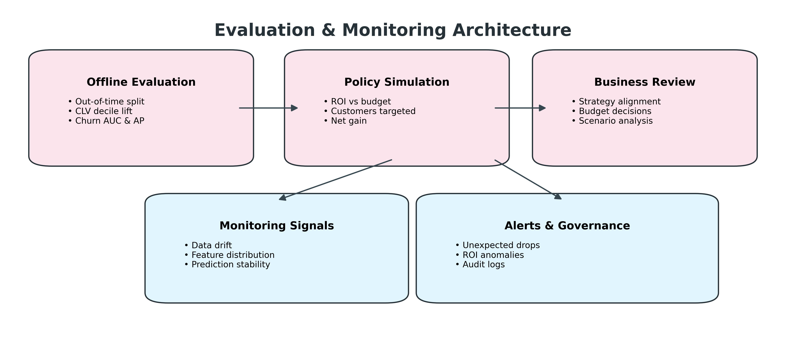
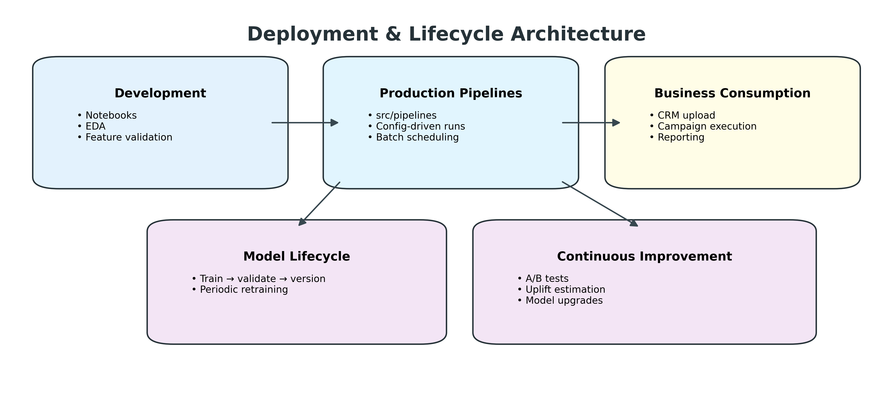

# Architecture Overview  
## Customer Lifetime Value (CLV) with Long-Term Optimization

---

## 1. Introduction and Architectural Intent

This document describes the **complete system architecture** of the *Customer Lifetime Value (CLV) with Long-Term Optimization* project.

The purpose of this architecture is not merely to build predictive models, but to construct a **decision intelligence system** that helps a business decide *which customers to invest retention budget in*, under real-world constraints such as limited budget, uncertain outcomes, noisy data, and changing customer behavior.

The architecture is deliberately designed to reflect how **real production data science systems** are built in industry:
- data quality is treated as foundational
- modeling is probabilistic and interpretable
- predictions are translated into economics
- optimization enforces business constraints
- evaluation focuses on business impact, not just accuracy
- deployment and monitoring are first-class concerns

---

## 2. End-to-End System Architecture

### 2.1 Overview of the End-to-End Flow

At the highest level, the system follows a **sequential but modular flow**:

Raw transactional data is ingested and cleaned → customer behavior is summarized into features → predictive models estimate future value and churn risk → those predictions are translated into expected monetary impact → an optimization layer selects customers under a fixed budget → outputs are evaluated and monitored over time.

Each stage has a **single responsibility** and produces outputs that are explicitly validated before being passed downstream.

---

### 2.2 Raw Data Layer

The system begins with raw transactional data sourced from `online_retail_II.xlsx`.  
This dataset represents real retail activity and includes invoice-level records with customer identifiers, timestamps, quantities, and prices.

At this stage, the data is **not trusted**. It may contain:
- cancelled transactions
- returns represented as negative quantities
- missing customer identifiers
- zero or invalid prices
- duplicated or inconsistent records

The architecture intentionally separates raw data from cleaned data so that **no business logic or modeling assumptions are applied prematurely**.

---

### 2.3 Data Cleaning and Validation Layer

The cleaning and validation layer exists to ensure that **every downstream model operates on economically meaningful purchase events**.

In this layer, the system:
- removes cancelled and reversed invoices
- filters out negative or zero quantities and prices
- enforces the presence of valid customer identifiers
- standardizes timestamps and data types
- validates schema consistency

This step is critical because **CLV and churn models assume that each transaction represents a real customer purchase**. Even small data quality violations can significantly distort lifetime value estimates.

All cleaning decisions are deterministic, logged, and reproducible, which is essential for auditing and trust.

---

### 2.4 Feature Engineering Layer

Once transactions are cleaned, the system transforms transaction-level data into **customer-level behavioral representations**.

Feature engineering is performed with strict respect to a **decision cutoff date**, ensuring time safety and preventing future data leakage.

For each customer, the system computes features that summarize purchasing behavior, including:
- how recently the customer purchased
- how frequently they purchase
- how much they tend to spend
- how long they have been active
- whether their spending is accelerating or declining

These features are designed to capture both **long-term value signals** (e.g., frequency, monetary value) and **short-term risk signals** (e.g., recent inactivity).

The output of this layer is a **single, stable customer feature table** with one row per customer. This table acts as the formal interface between data engineering and modeling.

---

### 2.5 CLV Modeling Layer

The CLV modeling component estimates the **expected future value of each customer** over a fixed horizon.

Instead of using black-box regression, the architecture employs **probabilistic customer lifetime models**:
- BG/NBD models the expected number of future purchases and probability that the customer is still “alive”
- Gamma-Gamma models the expected monetary value per transaction

These models are well-suited for transactional data because they:
- explicitly model purchasing processes
- handle sparse and irregular transactions
- produce interpretable parameters

CLV answers the fundamental business question:

> *If this customer continues purchasing, how much value are they expected to generate in the future?*

---

### 2.6 Churn Risk Modeling Layer

CLV alone is insufficient for decision-making because it assumes customers remain active.

The churn modeling layer estimates the **probability that a customer will become inactive** within a defined future window.

Churn is defined behaviorally (based on inactivity), and labels are constructed using future data that is strictly excluded from feature computation.

A logistic regression model is used to estimate churn probability because:
- it is interpretable
- it produces calibrated probabilities
- it performs well with structured behavioral features

Churn modeling answers a complementary question:

> *How likely is it that we will lose this customer’s future value?*

---

### 2.7 Economic Value Translation Layer

At this stage, predictions are transformed into **economic signals**.

The system computes the **expected value at risk** for each customer by combining:
- predicted CLV
- churn probability
- an assumed retention effectiveness parameter

This represents the expected value that could be saved if a retention action succeeds.

From this expected benefit, the system subtracts the cost of intervention, producing a **net expected gain**.

This step is where the architecture transitions from *prediction* to *decision*.

---

### 2.8 Budget Optimization Layer

Businesses do not have unlimited budgets.  
The optimization layer enforces this reality explicitly.

The system formulates a **budget-constrained optimization problem** where:
- each customer has a cost and expected net gain
- the objective is to maximize total net gain
- the total cost must not exceed the available budget

This is solved using a knapsack-style optimization.

The result is a **prioritized list of customers** that maximizes expected ROI under budget constraints, rather than relying on heuristics such as “top CLV only”.

---

### 2.9 Decision Output Layer

The final output of the system is a set of **actionable decision artifacts**, including:
- a ranked list of customers to target
- expected ROI and net gain summaries
- budget utilization statistics

These outputs are designed to be directly consumed by CRM systems, marketing teams, or strategy stakeholders.

The data science system does not execute campaigns — it **informs decisions**.

---

## 3. Data Pipeline and Feature Engineering Architecture

This architecture zooms into the **data transformation path**, showing how raw, messy transactional data is systematically converted into reliable customer features.

The separation between raw inputs, cleaned transactions, and engineered features ensures that:
- assumptions are explicit
- errors are localized
- features can be regenerated consistently for any cutoff date

This design allows historical backtesting, retraining, and auditing without ambiguity.

---

## 4. Evaluation and Monitoring Architecture

Evaluation is intentionally separated from production scoring to avoid bias and leakage.

The system uses **out-of-time evaluation**, meaning models are trained using data up to a cutoff date and evaluated using future behavior.

Evaluation focuses on:
- whether higher predicted CLV corresponds to higher realized revenue
- whether churn models rank risky customers correctly
- whether optimized policies produce sensible ROI curves

Monitoring extends evaluation into production by tracking:
- data drift
- feature distribution changes
- prediction stability
- ROI anomalies

This protects the system from silent degradation.

---

## 5. Deployment and Lifecycle Architecture

The deployment architecture reflects a **batch-first, production-oriented lifecycle**.

Exploration occurs in notebooks, but all production logic lives in versioned pipelines.  
Models follow a controlled lifecycle of training, validation, versioning, and deployment.

The system supports continuous improvement through:
- periodic retraining
- updated assumptions
- integration of experimental results (e.g., A/B tests)

---

## 6. Architectural Summary

This architecture ensures that:

- data quality is enforced before modeling
- customer behavior is represented faithfully
- predictions are interpretable and probabilistic
- decisions are economically justified
- constraints are enforced mathematically
- outputs are auditable and production-ready

In essence, the system transforms:

**Messy transactional data → structured customer behavior → probabilistic value and risk → optimized business decisions**

This is the core of professional decision intelligence in modern data science.